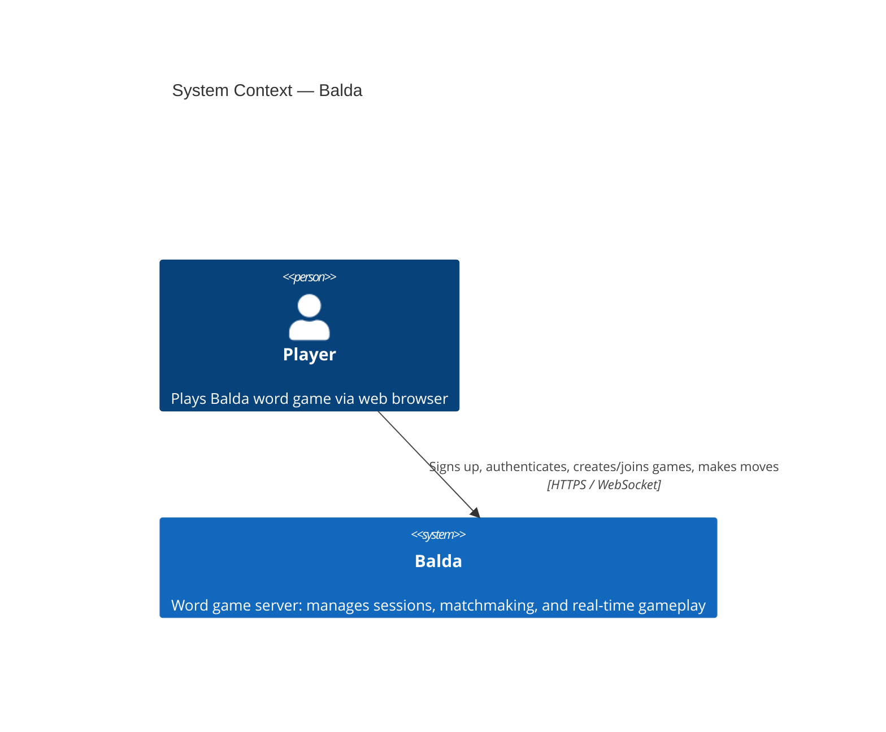
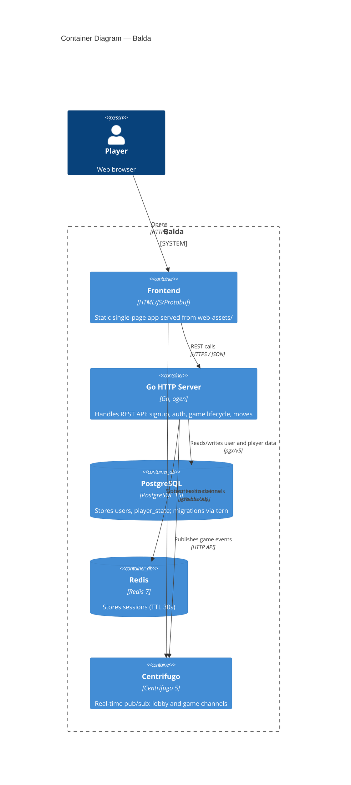
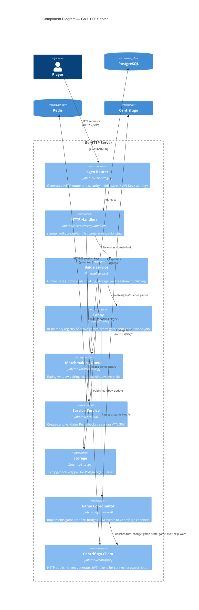

# Architecture — C4 Model

## Level 1 — System Context



---

## Level 2 — Container



---

## Level 3 — Component



---

## Level 4 — Code

Key structs and interfaces inside the `internal/game` package.

```mermaid
classDiagram
  class Game {
    -players []*Player
    -board *LettersTable
    -state GameState
    -current int
    -turn *Turn
    -eventCh chan TurnEvent
    -notifier Notifier
    +Run(ctx)
    +SubmitWord(playerID, newLetter, word) error
    +Skip(playerID) error
    +AckTimeout()
    +Kick()
    +Board() *LettersTable
    +PlayerScores() []PlayerState
    +CurrentPlayerID() string
    +Done() chan struct{}
  }

  class Player {
    +ID string
    +Exp int
    +Score int
    +Words []string
    +ConsecutiveTimeouts int
    +ConsecutiveSkips int
    +Kicked bool
  }

  class LettersTable {
    +Table [5][5]*Letter
    +NewLettersTable(word) (*LettersTable, error)
    +PutLetterOnTable(l) error
    +IsFull() bool
    +AsStrings() [5][5]string
    +InitialWord() string
  }

  class Letter {
    +RowID uint8
    +ColID uint8
    +Char string
  }

  class Notifier {
    <<interface>>
    +NotifyTurnStart(playerID)
    +NotifyTimeout(playerID, consecutive, willKick)
    +NotifySkip(playerID, consecutive, willEnd)
    +NotifyKick(playerID)
    +NotifyBoardFull()
  }

  class GameState {
    <<enumeration>>
    StateWaitingForMove
    StatePlayerTimedOut
    StateGameOver
  }

  class TurnEvent {
    <<enumeration>>
    EventMoveSubmitted
    EventTurnSkipped
    EventTurnTimeout
    EventAckTimeout
    EventKick
    EventBoardFull
  }

  class Dictionary {
    +Definition map[string]string
    +RandomFiveLetterWord() string
  }

  Game "1" --> "2" Player : manages
  Game "1" --> "1" LettersTable : owns
  Game ..> Notifier : uses
  Game --> GameState : tracks
  Game ..> TurnEvent : dispatches
  LettersTable "1" --> "0..25" Letter : contains
  Game ..> Dictionary : validates words
```
