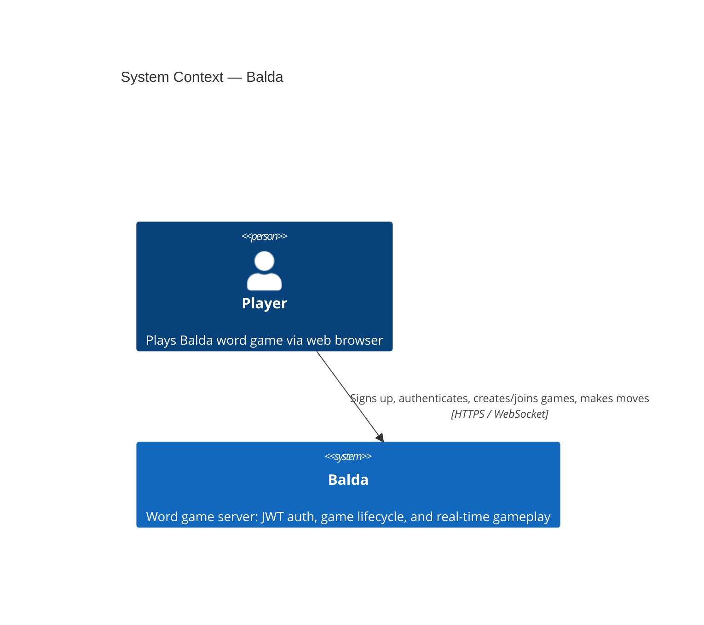
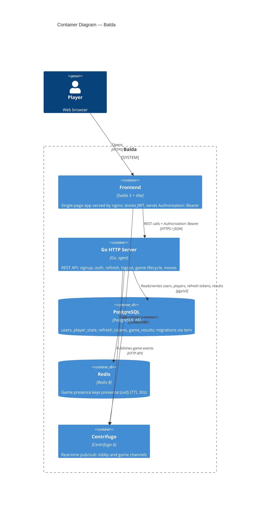
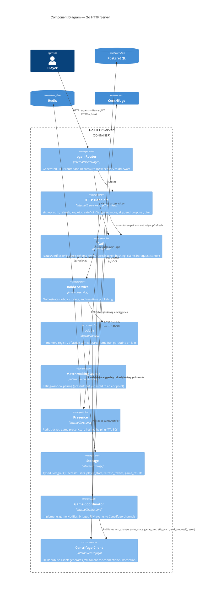

# Architecture — C4 Model

> The Mermaid diagrams below are the canonical, GitHub-rendered source of truth.
> A D2 variant lives in [`architecture.d2`](architecture.d2) with pre-rendered SVGs
> in [`architecture/`](architecture/) (`context.svg` / `container.svg` / `component.svg`);
> regenerate with `d2 docs/architecture.d2 docs/architecture.svg`.

## Level 1 — System Context

```mermaid
C4Context
  title System Context — Balda

  Person(player, "Player", "Plays Balda word game via web browser")

  System(balda, "Balda", "Word game server: JWT auth, game lifecycle, and real-time gameplay")

  Rel(player, balda, "Signs up, authenticates, creates/joins games, makes moves", "HTTPS / WebSocket")
```

---

## Level 2 — Container

```mermaid
C4Container
  title Container Diagram — Balda

  Person(player, "Player", "Web browser")

  System_Boundary(balda, "Balda") {
    Container(frontend, "Frontend", "Svelte 5 + Vite", "Single-page app served by nginx; stores JWT, sends Authorization: Bearer")
    Container(api, "Go HTTP Server", "Go, ogen", "REST API: signup, auth, refresh, logout, game lifecycle, moves")
    ContainerDb(postgres, "PostgreSQL", "PostgreSQL 16", "users, player_state, refresh_tokens, game_results; migrations via tern")
    ContainerDb(redis, "Redis", "Redis 8", "Game presence keys presence:{uid} (TTL 30s)")
    Container(centrifugo, "Centrifugo", "Centrifugo 6", "Real-time pub/sub: lobby and game channels")
  }

  Rel(player, frontend, "Opens", "HTTPS")
  Rel(frontend, api, "REST calls + Authorization: Bearer", "HTTPS / JSON")
  Rel(frontend, centrifugo, "Subscribes to channels", "WebSocket")
  Rel(api, postgres, "Reads/writes users, players, refresh tokens, results", "pgx/v5")
  Rel(api, redis, "Tracks player presence", "go-redis/v9")
  Rel(api, centrifugo, "Publishes game events", "HTTP API")
```

---

## Level 3 — Component

```mermaid
C4Component
  title Component Diagram — Go HTTP Server

  Person(player, "Player")
  ContainerDb(postgres, "PostgreSQL")
  ContainerDb(redis, "Redis")
  Container(centrifugo, "Centrifugo")

  Container_Boundary(api, "Go HTTP Server") {
    Component(ogen, "ogen Router", "internal/server/ogen", "Generated HTTP router and BearerAuth (JWT) security middleware")
    Component(handlers, "HTTP Handlers", "internal/server/restapi/handlers", "signup, auth, refresh, logout, create/join/list game, move, skip, end-proposal, ping")
    Component(authpkg, "Auth", "internal/auth", "Issues/verifies JWT access tokens; HMAC refresh-token hashing; claims in request context")
    Component(svc, "Balda Service", "internal/service", "Orchestrates lobby, storage, and real-time publishing")
    Component(lobby, "Lobby", "internal/lobby", "In-memory registry of active games; starts game.Run goroutine on join")
    Component(mm, "Matchmaking Queue", "internal/matchmaking", "Rating-window pairing (present; not yet wired to an endpoint)")
    Component(presence, "Presence", "internal/presence", "Redis-backed game presence; refreshed by ping (TTL 30s)")
    Component(storage, "Storage", "internal/storage", "Typed PostgreSQL access: users, player_state, refresh_tokens, game_results")
    Component(gamecoord, "Game Coordinator", "internal/gamecoord", "Implements game.Notifier; bridges FSM events to Centrifugo channels")
    Component(cfclient, "Centrifugo Client", "internal/centrifugo", "HTTP publish client; generates JWT tokens for connection/subscription")
  }

  Rel(player, ogen, "HTTP requests + Bearer JWT", "HTTPS / JSON")
  Rel(ogen, authpkg, "Verifies access token")
  Rel(ogen, handlers, "Routes to")
  Rel(handlers, authpkg, "Issues token pairs on auth/signup/refresh")
  Rel(handlers, svc, "Delegates domain logic")
  Rel(handlers, presence, "Refreshes presence on ping")
  Rel(handlers, cfclient, "Publishes game_created, lobby_update")
  Rel(svc, lobby, "Creates/joins/queries games")
  Rel(svc, storage, "Reads players; persists refresh tokens and results")
  Rel(lobby, gamecoord, "Passes as game.Notifier")
  Rel(gamecoord, cfclient, "Publishes turn_change, game_state, game_over, skip_warn, end_proposal(_result)")
  Rel(storage, postgres, "SQL queries", "pgx/v5")
  Rel(presence, redis, "GET/SET presence:{uid}", "go-redis/v9")
  Rel(cfclient, centrifugo, "POST /publish", "HTTP + apikey")
```

---

## Level 4 — Code

Key structs and interfaces inside the `internal/game` package.

```mermaid
classDiagram
  class Game {
    -players []*Player
    -board *LettersTable
    -state GameState
    -current int
    -turn *Turn
    -eventCh chan TurnEvent
    -notifier Notifier
    +Run(ctx)
    +SubmitWord(playerID, newLetter, word) error
    +Skip(playerID) error
    +ProposeEnd(playerID) error
    +AcceptEnd(playerID) error
    +RejectEnd(playerID) error
    +AckTimeout()
    +Kick()
    +Board() *LettersTable
    +PlayerScores() []PlayerState
    +CurrentPlayerID() string
    +Done() chan struct&#123;&#125;
  }

  class Player {
    +ID string
    +Exp int
    +Score int
    +Words []string
    +ConsecutiveTimeouts int
    +ConsecutiveSkips int
    +Kicked bool
  }

  class LettersTable {
    +Table [5][5]*Letter
    +NewLettersTable(word) (*LettersTable, error)
    +PutLetterOnTable(l) error
    +IsFull() bool
    +AsStrings() [5][5]string
    +InitialWord() string
  }

  class Letter {
    +RowID uint8
    +ColID uint8
    +Char string
  }

  class Notifier {
    <<interface>>
    +NotifyTurnStart(playerID)
    +NotifyTimeout(playerID, consecutive, willKick)
    +NotifySkip(playerID, consecutive, willEnd)
    +NotifyKick(playerID)
    +NotifyEndProposed(proposerID)
    +NotifyEndAccepted()
    +NotifyEndRejected(remaining)
    +NotifyGameFinished()
  }

  class GameState {
    <<enumeration>>
    StateWaitingForMove
    StatePlayerTimedOut
    StateEndProposed
    StateGameOver
  }

  class TurnEvent {
    <<enumeration>>
    EventMoveSubmitted
    EventTurnSkipped
    EventTurnTimeout
    EventAckTimeout
    EventKick
    EventEndProposed
    EventEndAccepted
    EventEndRejected
    EventGameFinished
  }

  class Dictionary {
    +Definition map[string]string
    +RandomFiveLetterWord() string
  }

  Game "1" --> "2" Player : manages
  Game "1" --> "1" LettersTable : owns
  Game ..> Notifier : uses
  Game --> GameState : tracks
  Game ..> TurnEvent : dispatches
  LettersTable "1" --> "0..25" Letter : contains
  Game ..> Dictionary : validates words
```
